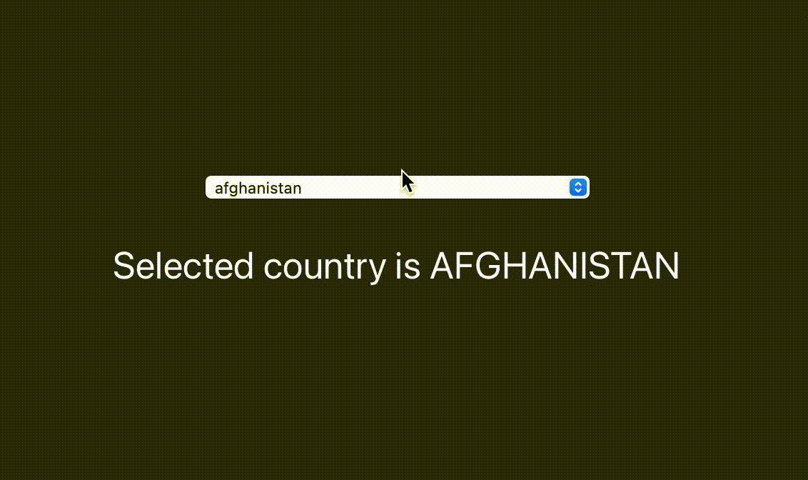

## Global-countries example

This is a DROPDOWN example to select countries in React.JS

### Code:

---

```javascript
import React, { useState } from "react";

// require library
const globalCountries = require("global-countries");

// declare countries
const countries = globalCountries.countries();

function App() {
  const [value, setValue] = useState(countries[0].country);

  return (
    <div className="App">
      <div className="dropdown">

        {/* countries dropdown created */}

        <select onChange={(e) => setValue(e.target.value)} value={value}>
          {countries.map(({ country, isoCodes }) => (
            <option key={isoCodes} value={country}>
              {country}
            </option>
          ))}
        </select>

        {/* Selected country */}

        <p>Selected country is {value.toUpperCase()}</p>

      </div>
    </div>
  );
}

export default App;
```

### Output:

---


